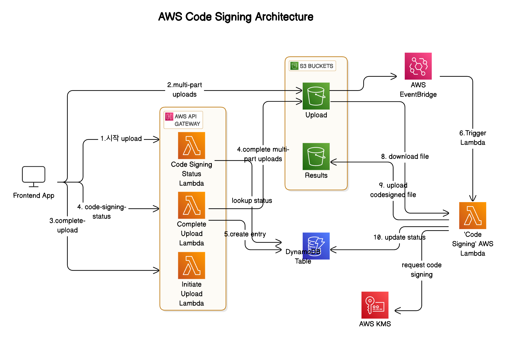

# serverless-code-signing-with-aws-kms-demo
This is demo implementation of application code signing solution with AWS KMS and AWS serverless services

# 개요

본 문서에서는 어플리케이션 서명(Code Signing)을 위한 솔루션 데모 구현 내용을 설명합니다. 이 데모 솔루션은 https://sbstjn.com/blog/aws-serverless-code-signing-windows-extended-validation-kms/ 문서의 내용에 기반하여 구현하였습니다. 특히 AWS API Gateway를 통해 Code Signing을 위한 API를 추가하였고 Demo Frontend App을 통해 해당 API들을 활용하여 데모를 구현하였습니다. 또한 Code Signing 사용자 시나리오의 특성 상 가능한 사용자가 code signing을 요청할 때만 AWS 서비스 리소스들에 대한 과금이 발생하도록 AWS serverless 서비스들을 활용하여 비용을 최소화 할 수 있도록 구현하였습니다. 

Amazon KMS 는 암호화 키를 생성, 제어를 위한 AWS 관리형 서비스로 FIPS 140-2 Security Level 3 인증을 획득한 하드웨어 보안 모듈(HSM)을 이용하여 암호화 키를 관리합니다. 본 예제에서는 AWS KMS 서비스를 접근할 때 FIPS 140-2를 준수하는 TLS endpoint를 사용하였습니다. 

아래는 데모 솔루션의 아키텍처 다이어그램입니다.




# 상세 구현 상세 절차

아래는 데모 solution 구현 절차를 기술하였습니다. 서울 리전(ap-northeast-2)에서 amazon linux 2 instance를 개발머신으로 사용할 경우를 가정하고 기술합니다. 

## Pre-requisites

- Install AWS CLI latest version ([link](https://docs.aws.amazon.com/cli/latest/userguide/getting-started-install.html)). It is assumed that you provided user credential with ‘AdministratorAccess’ permission for demo implementation with below command.

```bash
aws configure
```

- Install git

```bash
sudo yum install -y git
```

- Install openjdk-8-jdk ([Jsign](https://github.com/ebourg/jsign) requires Java 8 or higher)

```
sudo rpm --import https://yum.corretto.aws/corretto.key
sudo curl -L -o /etc/yum.repos.d/corretto.repo https://yum.corretto.aws/corretto.repo
sudo yum install -y java-1.8.0-amazon-corretto-devel
java -version
openjdk version "1.8.0_432"
OpenJDK Runtime Environment Corretto-8.432.06.1 (build 1.8.0_432-b06)
OpenJDK 64-Bit Server VM Corretto-8.432.06.1 (build 25.432-b06, mixed mode)
```

- Install maven (v3.2.5 or higher) for [Jsign](https://github.com/ebourg/jsign) build 

```bash
# install maven 3.6.3
wget https://archive.apache.org/dist/maven/maven-3/3.6.3/binaries/apache-maven-3.6.3-bin.tar.gz
tar -xvf apache-maven-3.6.3-bin.tar.gz 
sudo mv apache-maven-3.6.3 /opt/

#Set Environment variables. Add below 2 lines to ~/.bash_profile
export M2_HOME=/opt/apache-maven-3.6.3 
export PATH=$M2_HOME/bin:$PATH

# Apply the changes
source ~/.bash_profile

# verify the version
mvn -version
Apache Maven 3.6.3 (cecedd343002696d0abb50b32b541b8a6ba2883f)
```

- Install docker

```bash
sudo amazon-linux-extras install docker
sudo service docker start
sudo usermod -a -G docker ec2-user

# close current SSH terminal window and reconnect as new connection to run the docker command
exit

# after reconnecting
docker
Usage:  docker [OPTIONS] COMMAND
```

- Install CDK

```bash
curl -o- https://raw.githubusercontent.com/nvm-sh/nvm/v0.40.0/install.sh | bash
nvm install 18
nvm use 18

node -v
v16.20.2

npm -g install typescript
npm install -g aws-cdk

cdk --version
2.164.1 (build bb9275c)
```


## 1. Code Signing 용 인증서 생성

본 예제에서는 데모를 위해 code signing 용 인증서를 위해 상용 Extended Validation(EV) Code Signing 인증서를 구매하는 대신 AWS Private Certificate Authority 서비스를 이용하여 code signing용 인증서를 생성합니다. 실제 서비스를 위해서는 상용 Public Code Signing 인증서를 구매하여 사용할 것을 권고합니다.


### 1) AWS Certificate Manager - Private CA 설정

아래와 같이 AWS CLI를 이용하여 Private CA를 생성하고 생성된 CA가 사용할 루트(root) 인증서를 생성합니다.

```
#1. Write CA configuration

AWS_REGION=ap-northeast-2
ACCOUNT_ID={enter-your-account-id-here}

cat > ca-config.json << EOF
{ 
    "KeyAlgorithm": "EC_prime256v1", 
    "SigningAlgorithm": "SHA256WITHECDSA", 
    "Subject": {
        "Country": "KR", 
        "State": "Seoul", 
        "Locality": "Seoul", 
        "Organization": "Grilled Salmon Inc.", 
        "OrganizationalUnit": "IT Department", 
        "CommonName": "grilledsalmon.site"
    }
}
EOF

#2. Create a private CA

# Use standard endpoint for AWS private CA
# Currently FIPS (acm-pca-fips.) endpoint is supported only in US and Canada regions.
AWS_USE_FIPS_ENDPOINT=false

CA_ARN=$(aws acm-pca create-certificate-authority \
    --certificate-authority-configuration file://ca-config.json \
    --certificate-authority-type ROOT \
    --endpoint-url https://acm-pca.ap-northeast-2.amazonaws.com \
    --query "CertificateAuthorityArn" --output text)

#3. Create root certificate

# A CA is created but not ready state yet until root certificate is created. 
# Let's create root certificate

# Get CertificateSigningRequest for CA
aws acm-pca get-certificate-authority-csr \
     --certificate-authority-arn $CA_ARN \
     --output text \
     --region $AWS_REGION > ca.csr

# Using the CSR, issue root certificate
CA_CERTIFICATE_ARN=$(aws acm-pca issue-certificate \
     --certificate-authority-arn $CA_ARN \
     --csr fileb://ca.csr \
     --signing-algorithm SHA256WITHECDSA \
     --template-arn arn:aws:acm-pca:::template/RootCACertificate/V1 \
     --validity Value=365,Type=DAYS \
     --region $AWS_REGION \
     --query "CertificateArn" --output text)
     

# Then retrieve the root certificate 
aws acm-pca get-certificate \
    --certificate-authority-arn $CA_ARN \
    --certificate-arn $CA_CERTIFICATE_ARN \
    --output text > cert.pem

#4. import the root CA certificate 
aws acm-pca import-certificate-authority-certificate \
     --certificate-authority-arn $CA_ARN \
     --certificate fileb://cert.pem  
```

Now a private CA is ready to use. 


### 2) Create a CSR(Code Signing Request) with the private key in the AWS KMS

본 단계에서는 AWS KMS에 어플리케이션 Code Signing 용도 (SIGN_VERIFY)의 암호화 키페어를 생성하고 CSR(Certificate Signing Request)를 만듭니다. 이 때 aws-kms-sign-csr.py 도구를 사용하여 AWS KMS에 있는 keypair로 CSR의 public key를 업데이트 하고 signing 합니다. 

```
# Let's use FIPS endpoint for takging advantage of FIPS 140-2 Security Level 3 certification
ENDPOINT_URL="https://kms-fips.ap-northeast-2.amazonaws.com"

# Create a KMS key with Eliptic Curve key spec for signing 
KEY_ID=$(aws kms create-key --key-spec ECC_NIST_P256 --key-usage SIGN_VERIFY --query "KeyMetadata.KeyId" --output text)

# assign an alias so we can eaily refer the key with alias name
aws kms create-alias --alias-name alias/code-signing-ecc-20241030 --target-key-id $KEY_ID

# Create a temporary CSR with disposable private key
openssl req -new \
    -newkey ec:<(openssl ecparam -name prime256v1) \
    -keyout /dev/null -nodes \
    -out request_temp.csr \
    -subj "/CN=grilledsalmon.info/O=grilledsalmon/C=KR"

# clone aws-kms-sign-csr tool from repo
git clone https://github.com/g-a-d/aws-kms-sign-csr.git

# install python modules for aws-kms-sign-csr
pip3 install pyasn1 pyasn1_modules boto3

# Replace signature and public key in the CSR using AWS KMS and Sign CSR with the private key
# We will use aws-kms-sign-csr.py script to access AWS KMS key
./aws-kms-sign-csr/aws-kms-sign-csr.py --region $AWS_REGION \
    --keyid $KEY_ID \
    --hashalgo sha256 \
    --signalgo ECDSA \
    request_temp.csr > request.csr
    
```

### 3) Create a code signing certificate from request.csr

이 단계에서는 위에서 만든 CSR로 AWS CA 서비스에 CODE_SIGNING 용 인증서를 요청합니다.

Note that CODE_SIGNING usage must be specified in **ExtendedKeyUsage** field when using ‘issue-certificate’ command to bound the certificate for code signing use case. (Refer [Link](https://aws.amazon.com/blogs/security/how-to-issue-use-case-bound-certificates-with-aws-private-ca/)) 

```
# Submit CSR to ACM PCA to issue a certificate

# Set AWS_USE_FIPS_ENDPOINT to false as Azure Certificate Manager doesn't support FIPS endpoint in Seoul region.
AWS_USE_FIPS_ENDPOINT=false

# Issue certificate for CODE_SIGNING
CERTIFICATE_ARN=$(aws acm-pca issue-certificate \
    --certificate-authority-arn $CA_ARN \
    --csr fileb://request.csr \
    --template-arn arn:aws:acm-pca:::template/BlankEndEntityCertificate_APIPassthrough/V1 \
    --api-passthrough "Extensions={ExtendedKeyUsage=[{ExtendedKeyUsageType="CODE_SIGNING"}]}" \
    --signing-algorithm "SHA256WITHECDSA" \
    --validity Value=364,Type="DAYS" \
    --query "CertificateArn" --output text)
```

### 4) Extract certificate (with certificate chain file) 

Now using aws acm-pca get-certificate, retrieve the code signing certificate along with certificate chain file.

```
# get certificate.cer
aws acm-pca get-certificate \
    --certificate-authority-arn $CA_ARN \
    --certificate-arn $CERTIFICATE_ARN \
    --query '{cert:Certificate}' \
    --output text > certificate.cer

# get chain.pem
aws acm-pca get-certificate \
    --certificate-authority-arn $CA_ARN \
    --certificate-arn $CERTIFICATE_ARN \
    --query '{chain:CertificateChain}' \
    --output text > chain.pem
    
```

Both **certificate.cer** and **chain.pem** files are used when signing binaries with Jsign, a code signing tool in later steps.


## 2. Building [Jsign](https://ebourg.github.io/jsign/)

Jsign is a code signing tool written in Java. You can build Jsign using the commands below.

```
git clone https://github.com/ebourg/jsign
cd jsign/

mvn clean install -Djapicmp.skip=true -DskipTests
```

‘jsign/target/jsign-7.0-SNAPSHOT.jar’ will be used for later stage for code signing


## 3. Create a container image

We’ll run code signing tasks in containers that runs on Amazon ECR tasks. Let’s build the container first. 

The container will run below ‘handle.sh’ script and then exit. 


### 1) Create ‘image’ directory for docker build

```
cd ..
mkdir image
cd image/
```

### 2) Create handle.sh file 

‘handle.sh’은 Docker 에서 수행할 command로 ECS task에서 수행되어 code signing을 수행합니다. 아래 내용의 handle.sh 파일을 생성합니다.

```
#!/bin/bash

# Download file from S3

aws s3 cp s3://$BUCKET_UPLOADS/$FILE ./ || exit 1

# Configure jsign credentials from ENV or Fargate

if [ -z "$AWS_EXECUTION_ENV" ]; then
    AWS_AUTH="$AWS_ACCESS_KEY_ID|$AWS_SECRET_ACCESS_KEY|$AWS_SESSION_TOKEN"
    echo "no AWS_EXECUTION_ENV. use access key"
else
    AWS_AUTH=$(curl 169.254.170.2$AWS_CONTAINER_CREDENTIALS_RELATIVE_URI | jq '.AccessKeyId+"|"+.SecretAccessKey+"|"+.Token')
    echo "Use metadata"
fi

if [ "$AWS_AUTH" == "||" ]; then
    echo "Failed to retrieve credentials."
    exit 1
fi

# Sign downloaded file

if ! AWS_USE_FIPS_ENDPOINT=true java -jar jsign.jar \
    --storetype AWS \
    --keystore ap-northeast-2 \
    --storepass "$AWS_AUTH" \
    --alias "$KMS_KEY_ID" \
    --tsaurl http://timestamp.sectigo.com \
    --certfile certificate.cer $FILE; then
    exit 1
fi

# Verify signature

SIGNATURE_FAILED=$(osslsigncode verify -in ./$FILE -CAfile ./chain.pem | grep -c "Signature verification: failed")
if [ "$SIGNATURE_FAILED" == 1 ]; then
    echo "Failed to verify signature."
    exit 1
fi

# Calculate checksum for signed binary

CHECKSUM=$(openssl dgst -sha256 -binary "$FILE" | openssl base64 -A)

# Upload signed binary to S3

aws s3api put-object \
    --bucket "$BUCKET_RESULTS" \
    --key "$FILE" \
    --body "$FILE" \
    --checksum-algorithm SHA256 \
    --checksum-sha256 "$CHECKSUM" || exit 1

CODESIGNED_URL="https://$BUCKET_RESULTS.s3.$AWS_REGION.amazonaws.com/$FILE"
echo "Signed file uploaded successfully to ${CODESIGNED_URL}"

echo "Update DynamoDB table with primary key $FILE in $AWS_REGION region"

# Update DynamoDB table
aws dynamodb update-item \
    --table-name $DYNAMODB_TABLE_NAME \
    --key '{
        "objectKey": {"S": "'$FILE'"}
    }' \
    --update-expression "SET #status = :status, #url = :url" \
    --expression-attribute-names '{
        "#status": "status",
        "#url": "codeSignedUrl"
    }' \
    --expression-attribute-values '{
        ":status": {"S": "completed"},
        ":url": {"S": "'"$CODESIGNED_URL"'"}
    }' \
    --region $AWS_REGION

if [ $? -eq 0 ]; then
    echo "DynamoDB table updated successfully"
else
    echo "Failed to update DynamoDB table"
fi

# Delete unsigned binary from S3

aws s3 rm s3://$BUCKET_UPLOADS/$FILE || exit
```

### 3) Prepare Dockerfile

아래 Dockerfile을 생성합니다. 


```
cat > Dockerfile << EOF
FROM alpine:3

# Update and install necessary packages

RUN apk update && \
    apk upgrade && \
    apk add ca-certificates && \
    update-ca-certificates && \
    apk add --update coreutils build-base bash jq cmake openssl-dev curl-dev git aws-cli openjdk11 make curl openssl && \
    rm -rf /var/cache/apk/*

# Install osslsigncode

RUN git clone https://github.com/mtrojnar/osslsigncode.git && \
    cd osslsigncode && \
    mkdir build && \
    cd build && \
    cmake .. && \
    make && \
    make install && \
    rm -rf ./osslsigncode

# Copy local files

COPY . ./

# Run script
CMD ["bash", "handle.sh"]
EOF
```

또한 아래와 같이 Docker Image에 포함될 인증서 파일들과 jsign 바이너리를 아래와 같이 copy합니다. 


```
cp ../certificate.cer ./
cp ../chain.pem ./
cp ../jsign/jsign/target/jsign-7.0-SNAPSHOT.jar ./jsign.jar
```

### 3) Build the container image and create a ECR Repo and Upload the container image to the repo.

Create a ECR Repo and upload the newly created docker image.

```
ECR_REPO_NAME=signer-demo

aws ecr create-repository \
    --repository-name $ECR_REPO_NAME \
    --image-scanning-configuration scanOnPush=true \
    --encryption-configuration encryptionType=KMS \
    --region $AWS_REGION
    
```

Now run the docker image using ‘docker build’ command. (You need to run docker commands below in a system where a docker daemon is running.)

```
docker build -t signer-demo --platform linux/amd64 .

aws ecr get-login-password --region $AWS_REGION | docker login --username AWS --password-stdin $ACCOUNT_ID.dkr.ecr.$AWS_REGION.amazonaws.com

docker tag signer-demo:latest $ACCOUNT_ID.dkr.ecr.$AWS_REGION.amazonaws.com/signer-demo:latest
docker push $ACCOUNT_ID.dkr.ecr.$AWS_REGION.amazonaws.com/signer-demo:latest
```

Optionally, you can test the docker image on you local machine using ‘docker run’ command as below.

```bash
# Docker Test

# Set environment variables
ACCOUNT_ID={your-account-id-here}
REGION=ap-northeast-2
AWS_ACCESS_KEY_ID={your-aws-access-key-id}
AWS_SECRET_ACCESS_KEY={your-aws-secret-access-key}
BUCKET_UPLOADS={s3-upload-bucket-name}
BUCKET_RESULTS={s3-results-bucket-name}
KEY_ID={your-kms-key-id-here}
FILE={path-to-application-binary-to-codesign}

docker run \
    -e AWS_ACCESS_KEY_ID=$AWS_ACCESS_KEY_ID \
    -e AWS_SECRET_ACCESS_KEY=$AWS_SECRET_ACCESS_KEY \
    -e BUCKET_UPLOADS=$BUCKET_UPLOADS \
    -e BUCKET_RESULTS=$BUCKET_RESULTS \
    -e FILE=$FILE \
    -e KMS_KEY_ID=$KEY_ID \
    -it signer-demo /bin/bash

# then you will enter bash shell in the container. Run commands in handle.sh to verify if it works.
    
```


## 4. Deploy CDK stack

본 예제에서 사용하는 AWS 리소스들은 AWS CDK(Cloud Development Key)를 사용하여 배포합니다. 리소스 배포 코드는 아래 파일을 참고하시기 바랍니다. 
https://github.com/hyundonk/serverless-code-signing-with-aws-kms-demo/blob/main/cdk/lib/infra-stack.ts


아래의 명령들로 CDK 도구를 이용하여 해당 AWS 리소스들을 배포합니다.

```bash
cd ..

# Clone repo that has a CDK project
git clone https://github.com/hyundonk/serverless-code-signing-with-aws-kms-demo.git
cd serverless-code-signing-with-aws-kms-demo/cdk/

# Deploy CDK 
npm install
cdk synth
cdk deploy
...
codesigning: creating CloudFormation changeset...
...
Outputs:
InfraStack.ApiGatewayUrl = https://xxxxxxxxxx.execute-api.ap-northeast-2.amazonaws.com/prod/
InfraStack.BucketUploadsName = xxxxxxxx-demo-uploads-xxxxxx
InfraStack.UploadDemoApiEndpoint5F7683BB = https://xxxxxxxxxx.execute-api.ap-northeast-2.amazonaws.com/prod/
InfraStack.bucketResults = xxxxxxxx-results-xxxxxx 
```

배포가 성공적으로 완료되면 위 예제와 같이 ApiGatewayUrl 변수를 Output 변수값으로 출력합니다. 다음 절차인 Frontend 어플리케이션를 이용한 테스트 과정에서 Frontend 어플리케이션은 해당 변수값을 이용하여 해당 API Gateway URL로 API를 호출합니다. 


## 5. Test with frontend application

아래의 링크에 예제 Frontend 어플리케이션이 포함되어 있습니다. 로컬 머신에 다운로드 합니다. 
https://github.com/hyundonk/serverless-code-signing-with-aws-kms-demo/blob/main/frontend/index.html

해당 Frontend 어플리케이션을 웹서버와 함께 실행합니다. 아래는 Mac 환경에서 python HTTP server를 실행하는 예제입니다. 

```
# copy index.html file
cp ~/Downloads/index.html 

# Run web server in local machine listening 8000 (port can be changed)
./python3 -m http.server 8000
Serving HTTP on :: port 8000 (http://[::]:8000/) ...
```

웹 브라우저에서 “localhost:8000”을 실행합니다. 아래와 같이 페이지가 뜨면 Application Code Singing을 할 binary 파일을 선택하고 “Upload” 버튼을 Click합니다.


이 때 해당 Frontend Application은 아래의 과정을 수행합니다. 

- API Gateway의 Initiate-upload API를 호출합니다. 이 때 initiateUpload lambda함수가 호출되어 S3 multi-part 업로드을 위한 Multi-part upload를 생성 (CreateMultipartUploadCommand)하고 client에서 S3로의 업로드을 위한 pre-signed URL을 생성합니다. 초기화 합니다. (CreateMultipartUploadCommand)
- Pre-signed URL을 이용하여 S3로 파일을 업로드 합니다.
- 업로드가 끝나면 API Gateway의 complete-upload API를 호출하여 Multi-part upload를 완료합니다. 이 때 S3 upload 완료 event에 따라 Amazon ECS Fargate task가 실행되어 code-signing 작업을 시작합니다. 
- API Gateway의 code-signing-status API를 polling하여 code-signing 작업이 완료되었는지를 check합니다. 작업이 완료되면 code-signing-status API는 code-sign된 파일이 저장된 S3 객체의 pre-signed URL값을 return합니다. 

사용자는 이 URL을 click하여 해당 code-sign된 해당 binary를 다운로드 받을 수 있습니다.

